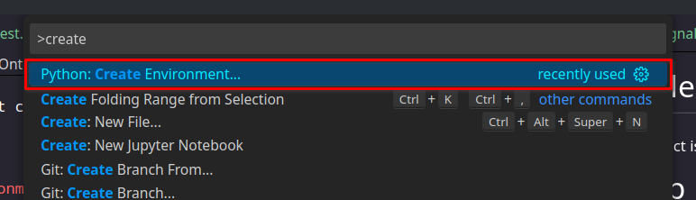

# Cradlepoint Elastic Database
This project is made to connect cradlepoint to an Elastic Stack by talking directly to Elasticsearch!

# Setup
## Requirements
This setup process requires first that you are running a `debian based linux operating system`, that you have a `Python 3.11` instance available, and that `kibana` and `elasticsearch` are installed using the `apt-get` package manager, setup with `security enabled`. Kibana and ElasticSearch **must have** the default ports setup, or else the program cannot properly talk with them.
## Setting up the Python Environment
This project uses `Python 3.11` or higher.
This code also expects a python environment to be available under a local directory named `.venv`.

### Using VSCode
If you use VSCode, this is a very simple process. Open the command palette (using ctrl-shift-p):



From here, choose a venv environment. VSCode will begin putting together the environment.

### Other Methods
Unfortunately, it is unknown how often this documentation will be updated; this could become a very different process in the future. Because of this, you might have to look up documentation on creating Python environments. If this is the case, just make sure that the directory name is `.venv` so that the code can find it.

## Downloading Dependencies
Once your virtual environment is setup, please verify that you are in the environment. You will know if you are in the environment if there is a `(.venv)` at the beginning of your command prompt. Example:
```
(.venv) user@cradlepoint-database:~/Documents/CradlepointMiddleware$
```
If your are not yet in the virtual environment, and in the base directory of the project location, simply run this command:
```bash
source ./venv/bin/activate
```
Now you should see the `(.venv)` at the beginning.

Once this is complete, write this command to download the necessary dependencies:
```bash
pip install -r requirements.txt
```

## Setting up Keys
Setting up keys will be one of the simpler tasks in the setup project. Along with the project, there should be a file named `.env_example`. Inside this file, you will find the following values:
```
# Keys available on Cradlepoint's tools site
X-CP-API-ID =  <key>
X-CP-API-KEY = <key>

# Keys available when making the key
X-ECM-API-ID = <key>
# WARNING: THIS KEY SHOWS UP ONLY
# ONCE WHEN YOU FIRST CREATE THE
# KEY
X-ECM-API-KEY = <key>

# Username and Password setup
# in elastic
ELASTIC-USERNAME = <username>
ELASTIC-PASSWORD = <password>

# Value is in seconds
UPDATE-INTERVAL = "300"

# Developer Tools
TEST-MODE = "false"
LOGGER-NAME = "application"
```
Fill in the variables corresponding to their listed purpose.

## Integrating Onto a Linux VM
The setup for this project is relatively simple. First, verify that the setup bash script and the run.cron.bash script are executable. Do this by running this command:
```bash
chmod +x "run.cron.bash" && chmod +x "setup.bash"
```
*RUNNING THIS COMMAND AS `SUDO` MAY BE REQUIRED*

Then, run the `setup.bash` script using `sudo`:

```bash
sudo ./setup.bash
```

From there, follow the prompts given. 

Your linux system should now be properely setup to retrieve data from cradlepoint, and store them into elasticsearch.

# Future Plans
Currently, the setup process for this program is fairly complicated. The future plans as it currently stands is to move into a docker container, that way running this on a server will be far easier.